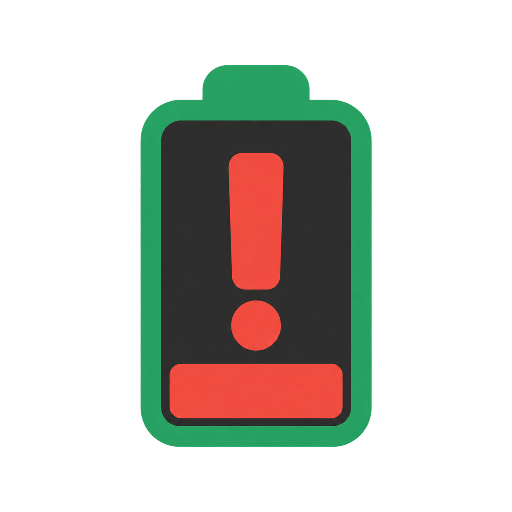

# BatteryGuard — alarm powyżej 60%

Instalator Inno Setup: `BatteryGuard-Setup-0.1.3.exe`. Instalacja dla bieżącego użytkownika, bez administratora. Program i deinstalator używają ikony pełnej czerwonej baterii. Wersja 0.1.3 pokazuje wynik ręcznego sprawdzenia w osobnym oknie. Odinstalowanie: **Ustawienia Windows → Aplikacje → Zainstalowane aplikacje → BatteryGuard → Odinstaluj**. Deinstalator zamyka monitor i usuwa jego skróty oraz autostart zainstalowanej wersji.

Kompilacja instalatora: `powershell -NoProfile -ExecutionPolicy Bypass -File .\build-installer.ps1 -Compiler "C:\Program Files (x86)\Inno Setup 6\ISCC.exe"`.



Po kompilacji uruchom `dist/BatteryGuard.exe`. Program działa w tle; ikonę znajdziesz przy zegarze, czasem pod strzałką ukrytych ikon.

- Odczytuje baterię co 15 sekund i ostrzega od 61%, także gdy przy uruchomieniu bateria jest już powyżej limitu.
- Ikona zasobnika zmienia się co 15 sekund zgodnie z poziomem: poniżej 20% — wykrzyknik; od 20% do 60% włącznie — zielone wypełnienie do 60%; powyżej 60% — pełne czerwone wypełnienie. Wskaźnik zielony jest stałym symbolem dobrego zakresu, nie odzwierciedla każdego procentu. Przy braku odczytu zostaje ostatnia ikona, a opis wskazuje brak danych. Niski poziom zmienia ikonę, bez dodawania nowego alarmu.
- Pokazuje powiadomienie Windows z systemowym dźwiękiem powiadomienia (zgodnie z ustawieniami Windows), bez dodatkowego sygnału programu. Gdy poziom pozostaje powyżej 60%, przypomina co 10 minut.
- Każdy odczytany wzrost powyżej 60% powoduje kolejny alarm, np. 61% → 62% → 63%. Spadek nie wywołuje alarmu, ale późniejszy wzrost ponownie go wywoła. Przy skoku np. 61% → 64% pojawi się jeden alarm z aktualnym poziomem 64%; program nie odtwarza pominiętych poziomów.
- Alarm pojawia się też przy uruchomieniu programu z baterią powyżej 60% oraz po ręcznym wybraniu **Sprawdź teraz**. Każdy alarm rozpoczyna od nowa 10 minut do kolejnego przypomnienia.
- Po odczytanym spadku powyżej 60% automatyczne przypomnienia są wstrzymane, także gdy poziom później stoi w miejscu. Dopiero ponowny wzrost je wznawia. Poniżej 20% zmienia się wyłącznie ikona — program nie wysyła automatycznych alarmów niskiego poziomu.
- Po spadku do 60% lub niżej ponownie uzbraja alarm.
- Prawy przycisk na ikonie → **Uruchamiaj po zalogowaniu** włącza lub wyłącza autostart dla bieżącego użytkownika. Włącz go dopiero po umieszczeniu folderu w docelowym miejscu; po przeniesieniu wyłącz i włącz tę opcję ponownie.
- **Sprawdź teraz** otwiera okno z bieżącym odczytem, widoczne także przy wyciszonych powiadomieniach Windows. **Zakończ** zamyka monitor.

Program nie zmienia limitów G-Helper ani ASUS. Monitoruje poziom baterii również po odłączeniu zasilacza. Podczas uśpienia nie działa; po wznowieniu sprawdzi stan przy kolejnym odczycie. Widoczność powiadomień i dźwięku zależy od ustawień Windows, trybu Nie przeszkadzać i głośności.

Nie wymaga instalacji ani uprawnień administratora. Wykorzystuje Windows i .NET Framework 4.x. Aby usunąć program, najpierw wyłącz autostart, zakończ działanie i usuń folder.

Źródło: `BatteryGuard.cs`. Kompilacja w PowerShell (tworzy także ikonę ICO w wielu rozmiarach z zatwierdzonego PNG):

```powershell
powershell -NoProfile -ExecutionPolicy Bypass -File .\build.ps1
```

Zbudowany plik `dist/BatteryGuard.exe` działa samodzielnie; ikona jest osadzona w programie. Licencja: MIT — zobacz [LICENSE](LICENSE).
